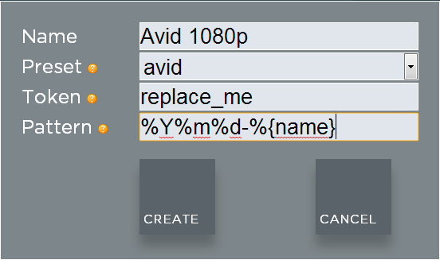
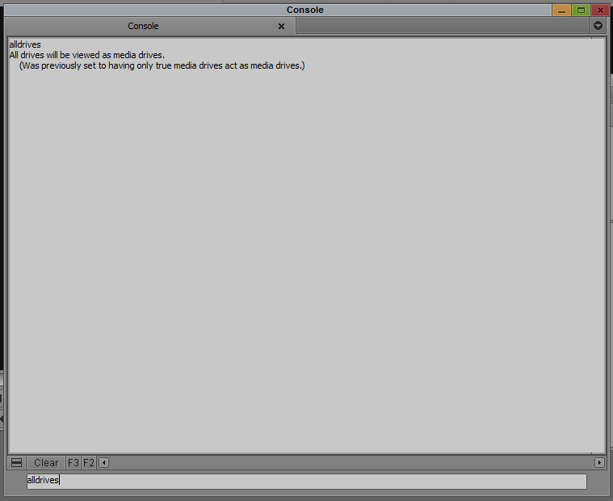
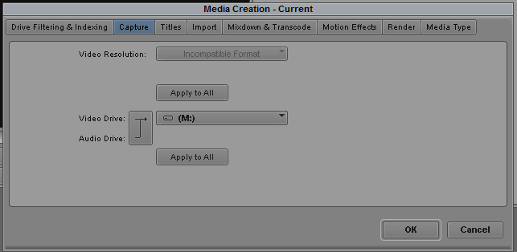
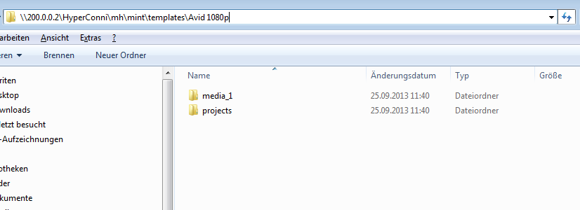
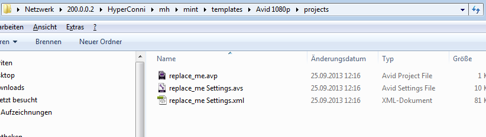
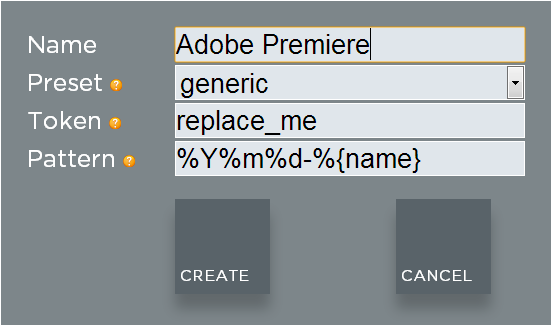
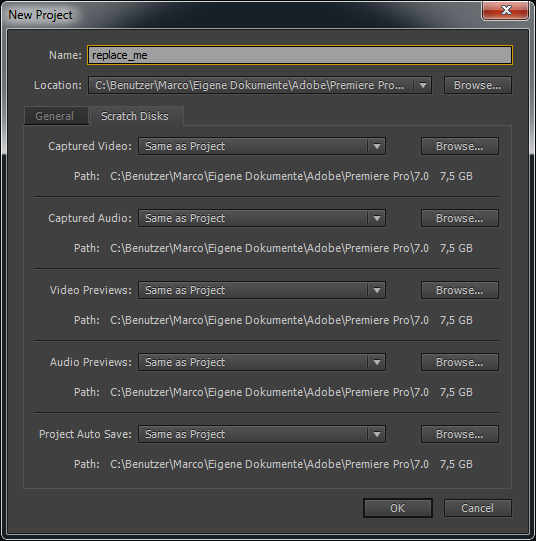
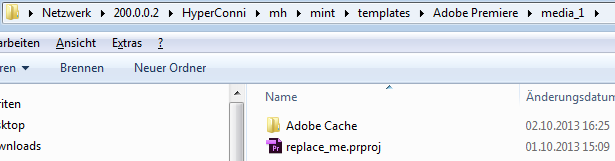

.. role:: admin_ui_button(strong)

************************************************
Working with Templates / Video Editing Softwares
************************************************

Templates are comparable to containers. You can create a template for any kind of
project or production and customize it to your specific requirements. A template
can contain custom file and folder structures or a pre-configured project file from
an editing application of your choice. If an editor chooses a template upon project
creation in the Mint client Application, the file and folder structure that you
predefined will automatically be copied into the new project.

-------------------------------------------
Creating a Template for Avid Media Composer
-------------------------------------------

Before you can create an Avid editing project using the Mint client software you
need to create a template. How this done is explained in the :ref:`creating-a-template`
section. Please make sure to select the **avid** preset.

Since you will be creating a format-specific template in Avid Media Composer, it would
be a good idea to include the format in the template's name. In this example we will
create an Avid template that contains a high definition Avid project with a resolution
of 1080p, and therefore call the template *Avid 1080p*.

.. _fig-create-avid-template:

  Create an Avid template

After you are done click :admin_ui_button:`CREATE` and open Avid Media Composer. Create a new
local project called *replace_me* with the setting *1080p25*.

Open the newly created project, delete the bin and empty the Avid trash folder.

Now make sure that Avid is able to recognize network volumes as media drives. Open **Tools** > **Console** 
and type in **alldrives** If you see the message *All drives will be viewed as media drives. (Was previously set to having only true media drives act as media drives.)* you are good to go. If you see the message *Only true
media drives will be viewed as media drives. (Was previously set to having all drives
act as media drives.)* type **alldrives** again. There are just two possible options.

.. _fig-alldrives:

  The **alldrives** setting

Now go to **Tools** > **Media Creation** > **Capture** and select the Mint media drive
(mounted on your Computer) as the Audio/Video file destination. Click on both
**Apply to All** buttons and then click on **OK**. Now close the project.

.. _fig-media-creation:

  The **Media Creation** dialog

Navigate to the Mint *template* folder on your storage (e.g., */mint/templates*). Within
that template folder you will see a folder that is named after the template you
created in the Mint admin panel. Inside this folder is a folder called *media_1* and
another folder called *projects*.

.. _fig-mint-template-dir:

  Template directory on the storage

Use the Finder or Explorer application to navigate to your local Avid projects folder (e.g.
*/Users/FlavourSys/Documents/Avid Projects*) and open the replace_me project
folder. Copy the files *replace_me.avp*, *replace_me Settings.xml*, and *replace_me
Settings.avs* to your clipboard.

Paste the files into the */mint/templates/Avid 1080p/projects* directory on the storage. If an 
editor creates a new project using this template, Mint will rename the *replace_me* string
after the project.

.. _fig-template-on-storage:

  Copied files to the storage

--------------------------------------
Creating a Template for Adobe Premiere
--------------------------------------

As with Avid, you first need to create a template in the admin panel. How this done 
is explained in the :ref:`creating-a-template` section. Please make sure to 
select the **avid** preset.

.. _fig-create-adobe-template:

  Create an Adobe template

After you are done click :admin_ui_button:`CREATE` and go to the Mint Client. Create a new project
using the Adobe Premiere 1080p template. Now open Adobe Premiere and create a
new project. Name the project *replace_me* and set the capture format to HDV.
Ensure that all Scratch Disk locations are set to same as project.

.. _fig-create-adobe-project:

  Create an Adobe project

Click **OK** to create and open the project. Once the project is opened go to
**Edit** > **Preferences Media** and choose the *Adobe Cache* on your Mint media
volume to be the destination for *Media Cache Files* and *Media Cache Database*.

.. _fig-adobe-preferences:
.. figure:: images/adobe-preferences.png
  :width: 800px
  :align: center
  :alt: Adobe preferences

  Adobe preferences

Click **OK** to confirm your changes. Now save the project and leave Adobe
Premiere. Navigate to your local Adobe projects folder and copy the newly created
project file *replace_me.prproj* to the *media_1* folder of the Adobe template
location that you created.

.. _fig-adobe-template-on-storage:

  Copied files on storage

Each time an editor creates a new project using the *Adobe
Premiere* template, the file *replace_me.prproj* will be renamed after the project.

