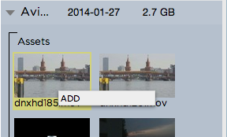

.. _index_projectlist:

#####################################
The Strawberry 4 Adobe Premiere Panel
#####################################

Purpose: The Strawberry 4 Adobe Premiere Panel allows users to access certain Strawberry 4 features directly from the user interface of Adobe Premiere Pro CC.

*******************
System Requirements
*******************

The Strawberry 4 Adobe Premiere Panel needs at least Adobe Premiere Pro CC 7.2.1 to work properly. Older version of Adobe Premiere Pro CC might work but will have issues with the playback of the Strawberry 4 proxy files in the panel. Adobe Premiere Pro CS5 and CS6 are not supported in combination with the panel.

*******************
Accessing the Panel
*******************

Launch the Strawberry 4 client application and login with your credentials. Create a project using the Adobe Premiere template or open an existing Premiere project. In Premiere navigate to the menu bar and click on Window / Extensions / Strawberry 4.

.. figure:: images/extensions.png
	:align: center
	:alt: Extensions.png

***********************************
Adobe Panel: Searching for Projects 
***********************************

To search for an editing project enable the **"projects"** checkbox below the search field and type your search criteria into the search field. Projects which have the search criteria in their **name**, **naming convention** or **description** will be displayed in the list below the search field.

*********************************
Adobe Panel: Searching for Assets
*********************************

To search for media or non-media assets enable the **"assets"** checkbox below the search field and type your search criteria into the search field. Assets which have the search criteria in their **name** or **description** will be displayed in the list below the search field.

**************************************************
Adobe Panel: Combined Search for Projects & Assets
**************************************************

To search for projects, assets and their related metadata simultaneously enable the "projects" and "assets" checkboxes below the search field and type your search criteria into the search field. Strawberry will now display matching search results for both projects and assets. For a better overview projects and assets are divided by a dotted line in the search results.

****************************************
Adobe Panel: Sorting Projects and Assets
****************************************

Within the Project Pane, you can sort projects by 

* Project/Asset Name (Name)
* Physical Size (Size)
* Creation Date (Created)

To sort your projects or assets based upon one of these criteria enable the "projects" checkbox below the search field (disable the "assets" checkbox) and click on "Name", "Size" or "Created". If you sort by one of these values click the value again to reverse the order of the search results in an Ascending or Descending manner.

********************************************
Adobe Panel: Expanding/Contract Project Pane
********************************************

To see the asset content of a project in the project list click on the arrow on the left to the project name. Strawberry will load the first 150 assets of the project sorted by name. For projects containing more than 150 assets, if you scroll down the asset list you will recognize a message saying "You have reached the maximum amount of displayable assets in this view. Click "View All Assets" to switch the view." Click this button to let Strawberry load all the assets from this project. To contract the project ("hide" its assets) imply click on the arrow on the left of the project name again.

.. figure:: images/expand-project-pane.png
	:align: center
	:alt: Expand Project Pane

*****************************************************************
Adobe Panel: Switching Between Grid View and List View for Assets
*****************************************************************

To switch between grid view (a.k.a thumbnail view) or list view (a.k.a list of names) click the button on the right to the "sort by size" column.

.. figure:: images/switch-grid-list.png
	:align: center
	:alt: Switch Between Grid List View for Assets

*******************************************************
Adobe Panel: Expand/Contract the Project and Asset Pane
*******************************************************

To expand or contract the project and asset pane click on the top right arrow of the left column.

**************************************************
Adobe Panel: Switch Between Project and Asset View
**************************************************

To switch between the project and the asset view just check or uncheck the "projects" and "assets" checkboxes below the search field. If both checkboxes are enabled Strawberry will show projects and assets in the list.

*****************************************************
Importing another Strawberry Managed Premiere Project
*****************************************************
In order to import another Premiere project into your own project use the panel to find that other project and select it. Once the project is selected you will see an "ADD" button next to its name. Pressing this button will trigger Premiere to import the project into your own project.

********************************************************************
Importing single Media Files from Another Strawberry Managed Project
********************************************************************

To import an asset from the panel into your current project select the asset and right click on it. A context menu showing an "ADD" button will open. click on this button to import the asset into your project.

Once you clicked the "ADD" button Strawbery will ask you whether you want to link or copy the file into your project. Linking means, that Strawberry will create a link from the files source project into your project which does not duplicate the file. You will have read only access to the file which is perfectly fine to work with it in Premiere. Copying means that Strawberry copies the file from its source project into your project giving you full read & write access to it. Once you decided for one of these options Strawberry will trigger Adobe Premiere to automatically import the file once it is linked or copied.

**************************
Frequently Asked Questions
**************************

Q: Can I use the panel without logging into Strawberry?

A: For the user authentication the Strawberry 4 Premiere Panel uses a token that is created by the server and locally saved by the client. For the panel to work the Strawberry 4 client applications needs to be opened and a user needs to be logged in.

Q: Do I have to manually launch the panel everytime I open my project?

A: If the panel is opened when you save and close the project it will automatically start when you open the project the next time.
