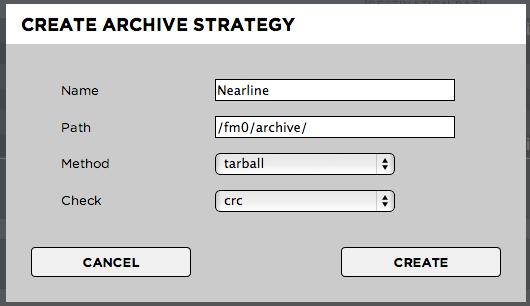

.. _index_archive:

#######
Archive
#######

Strawberry allows certain users (admins & users but not guests) to archive and retrieve editing projects. When performing an archive operation Strawberry takes every single file which is part of the project and sends it to an archive destination which was previously defined by the administrator. As soon as the project is in the archive Strawberry 4 will delete it from the "production storage (a.k.a source) but will keep the metadata and proxy files. The archive path defined here is also the retrieval path. If you look for a more sophisticated archival/retrieval process you should have a look inside the Strawberry API documentation.

****************************
Creating an Archive Strategy
****************************

**Purpose:** Archive strategies allow you to define discrete archive locations and methodologies for different types of projects. When a user presses the "Archive Project" button in the user front-end Strawberry will offer the archive strategies defined here.

**Usage:** Log into the admin panel and click on the "Archive" tab. Expand the "ARCHIVE STRATEGIES" bar. Click the "ADD" button and provide the following information:

* Name: The name of the archive strategy. The users see the name of the strategy when he or she attempts to archive a project.
* Path: The path (a.k.a archive destination) for projects archived using this strategy
* Method: 
	* plain: Strawberry archives the project and media files without compressing them. It archives the projects folder structure as it is.
	* tarball: Puts the project & media files of a project into a tarball before archiving it.
	* zip: Puts the project & media files of a project into a zip file before archiving it (Please note: Zip files can not be CRC checked).
* Check
	* Fingerprint: Sequential integrity check on a file that only detects serious file damages but no minor defects.
	* CRCs are specifically designed to protect against common types of errors on data transmissions, where they can provide quick and reasonable assurance of the integrity of data delivered. However, they are not suitable for protecting against intentional alteration of data.
	* None: No data integrity check at all 
* Enable/Disable Strategy: Define if an archive strategy is available for users (enabled) or not (disabled)

*************************
Project Backup Strategies
*************************

**Purpose:** Strawberry enables users to copy projects to another location. This location can be another storage device (for backup purpose), a render farm or external application. This feature works very similar to the "Archive" function. The difference is that copied projects will not be deleted from the media storage but remains there for further use.

**Usage:** Log into the admin panel and click on the "Archive" tab. Expand the "Project Backup Strategies" bar. Click the "ADD" button and provide the following information:

* Name: The name of the copy-to strategy. The users see the name of the strategy when he or she attempts to copy a project.
* Path: The path (a.k.a copy-to destination) for projects copied using this strategy
* Method
	* plain: Strawberry archives the project and media files without compressing them. It backups the projects folder structure as it is.
	* tarball: Puts the project & media files of a project into a tarball before copying it.
	* zip: Puts the project & media files of a project into a zip file before copying it (Please Note: Zip files can not be CRC checked).
* Check
	* Fingerprint: Sequential integrity check on a file that only detects serious file damages but no minor defects.
	* CRCs are specifically designed to protect against common types of errors on data transmissions, where they can provide quick and reasonable assurance of the integrity of data delivered. However, they are not suitable for protecting against intentional alteration of data.
	* None: No data integrity check at all.
* Enable/Disable Strategy: Define if an archive strategy is available for users (enabled) or not (disabled).

***********************
Asset Backup Strategies
***********************

**Purpose:** Strawberry enables users to copy individual assets to another location. This location can be another storage device (for backup purpose), a render farm or external application. This feature works very similar to the "Archive" function. The difference is that copied assets will not be deleted from the media storage but remain there for further use.

**Usage:** Log into the admin panel and click on the "Archive" tab. Expand the "Asset Backup Strategies" bar. Click the "ADD" button and provide the following information:

* Name: The name of the copy-to strategy. The users see the name of the strategy when he or she attempts to copy a project.
* Path: The path (a.k.a archive destination) for projects copied using this strategy
* Method
	* plain: Strawberry archives the project and media files without compressing them. It backups the projects folder structure as it is.
	* tarball: Puts the project & media files of a project into a tarball before copying it.
	* zip: Puts the project & media files of a project into a zip file before copying it (Please Note: Zip files can not be CRC checked).
* Check
	* Fingerprint: Sequential integrity check on a file that only detects serious file damages but no minor defects.
	* CRCs are specifically designed to protect against common types of errors on data transmissions, where they can provide quick and reasonable assurance of the integrity of data delivered. However, they are not suitable for protecting against intentional alteration of data.
	* None: No data integrity check at all.
* Enable/Disable Strategy: Define if an archive strategy is available for users (enabled) or not (disabled).
