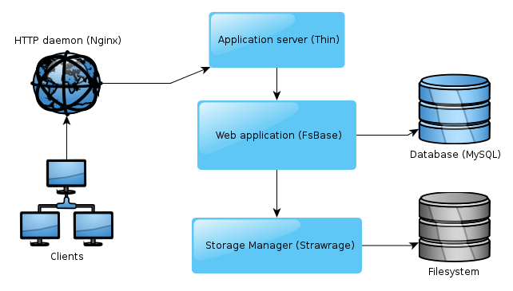

****************************
Installing the Mint back-end
****************************

So you decided to install the Mint back-end yourself? That's great! Technically, 
the Mint back-end can be considered a quite ordinary web application. It is driven by the magnificent
RubyOnRails framework and therefore should run on any recent *GNU/Linux*
distribution as well as other UNIX derivatives, such as Apple's *Darwin* and *BSD-based* distributions.
The installation process follows the standard procedure of installing a
RoR-based web service, i.e., setting up the HTTP daemon, configuring the
database, configuring the web service itself and, last but not least, firing up
the web service (at boot time). Nothing we haven't done before, right?

However, for the sake of convenience we created an installation script which
automates the procedure for the most common systems on which the Mint back-end is
likely to be installed. This means both a *common* GNU/Linux server distribution (Red Hat/CentOS
5.x-6.x or Debian 6.x-7.x) and a *fresh* installation, i.e., no pre-configured web server, no obscure
NicheSQL database and the like. In case you are going to install the Mint back-end
on a BSD derivative, or on an Apple Mac OSX system, or on your four-decades-old
mainframe - **which is just perfect** - you may experience some shortcomings of the
installation script. In this case we would kindly ask you to *infer* the necessary installation 
steps on your system from the source code of the very script.
 
=======================
The installation script
=======================

On a common GNU/Linux server system, the Mint installer will perform all the
steps required to convert your bare Linux machine into a fully-fledged, Ruby-running
web server. To start the installation, simply type ``./install.sh`` as root user 
into the command prompt. You will be greeted with the following overview of the installation::

  STATUS:
  ============================================================
  Detect the operating system ...................... [NOT RUN]
  Setup rpmforge repositories ...................... [NOT RUN]
  Configure the nginx repository ................... [NOT RUN]
  Install system packages .......................... [NOT RUN]
  Configure the MySQL database ..................... [NOT RUN]
  Create the installation directories .............. [NOT RUN]
  Install the Ruby interpreter from source ......... [NOT RUN]
  Install the Strawrage storage manager ............ [NOT RUN]
  Install the FsBase application ................... [NOT RUN]

You may then choose between running the installation automatically, running a
single task and exiting the installer. If you decide for the automatic
installation, the installer will try to execute the installation steps
sequentially in the order they are listed in the overview. When the installer fails 
to perform a certain task, you will be asked if you would like to continue the
installation anyway or would like to abort the installation. Furthermore, the
installation tasks may specify dependencies among each other (for example, the
FsBase installation requires Ruby to be installed), in which case the installer
will ask you a second time whether you really would like to continue.

The installation will require almost no attention from your side, apart from
the *MySQL database configuration* task asking you for a password once. Yet, other
than the Ruby compilation, which may take some minutes depending on your
hardware, the installation will not take much time in total, so do not walk
away too far.

If something goes wrong during the installation, you may have a look at the log file
(``install.sh.[date].log``) and, after having fixed the problem, restart the
installation from the point of failure. If any tasks repeatedly fails and you
would like to disable it entirely, simply delete the corresponding script from
the ``tasks/`` directory. We are going to implement a *Skip* feature in the
next installer version, promise.

When the installer has completed all its tasks, you should have a running Mint
back-end on your server, using a `Nginx <http://nginx.org/>`_ web server, a
`Ruby <http://www.ruby-lang.org/>`_ 1.9.3 interpreter, and a 
`MySQL <http://www.mysql.com/>`_ database.

==================================================
The manual way *or* What did you do to my system?!
==================================================

In the following, we will describe how to manually setup the Mint back-end As
said before, the installation resembles the standard procedure of setting up a
RubyOnRails web application. We will describe the setup process as done by
the Mint installer, you may choose to walk down a different path where it seems
fit.

The software infrastructure of the Mint back-end is shown below. The installer
puts the Mint back-end to its own directory below ``/opt/mint``, as well as any
third-party software not installed via the operating system's package manager
(e.g., Ruby, Strawrage). You may choose a different installation location, however, 
please make sure that everything is available to root by updating your ``PATH``
and dynamic linker configuration.

.. _fig-software-infrastructure:

  Software infrastructure of the Mint back-end

-------------------
System requirements
-------------------

The Mint back-end depends on only a few third-party software packages, of which most 
should be available for any Unix-like operating system. The full list of packages
installed by the installer script can be found in ``tasks/0x_system_packages.sh``.
If you would like to come up with your own list or if your operating system does
not have all the listed packages, please make sure your system has at least the following:

* A C/C++ compiler suite, e.g. *GNU gcc* or *LLVM*. Needed for Ruby
  compilation.
* GNU build tools, at least *libtool* and *pkg-config*. Needed for Strawrage.
* An OpenSSL-compatible SSL library. Needed for Strawrage.
* An implementation of the deflate algorithm, most likely *zlib*. Needed for Strawrage.

.. note::
  Running a Red Hat operating system, you need to register your installation with
  Red Hat in order to have access to the Red Hat package repositories, or
  enable the CentOS repositories in your *yum* configuration (see
  ``/etc/yum.repos.d``). For both Red Hat and CentOS distributions, it may be necessary
  to add the `RPMforge <http://wiki.centos.org/AdditionalResources/Repositories/RPMForge>`_
  repositories to your package manager, if you would like more recent versions
  of the required packages. Furthermore, Nginx may not be available in the official Red Hat
  repositories at all.

----------
Ruby 1.9.3
----------

Since the Mint back-end is implemented as a RubyOnRails web application, we need
a recent Ruby interpreter available to the root user. The current Mint revision
uses **Ruby 1.9.3p448**. You may either install Ruby using your operating
systems package manager or compile it from source, as done by the Mint
installer. Compiling from source is often the easier way and, given you have a
working C compiler installed, requires no more work than the usual command
triplet for Unix software::

    $ ./configure
    $ make
    $ make install

You may also choose to make use of one of Ruby installer scripts available
on the web, such as Sam Stephenson's `rbenv <https://github.com/sstephenson/rbenv>`_. 
After installation, please make sure that the Ruby interpreter has the 
correct version number by running as root::

    $ ruby -v
    ruby 1.9.3p448 (2013-06-27 revision 41675) [x86_64-linux]

--------------
MySQL Database
--------------

For storing the project metadata and relations, the Mint back-end requires a SQL
database server, which can either be running locally or remote depending on
the scale of your setup. The Mint installer configures a MySQL database to run
locally on the same host as the web application, however, any other major SQL
database (e.g., PostgreSQL, Oracle) should be fine too. Unfortunately, the Mint
back-end is known to have problems with the SQLite database.

Once you have setup your favorite database server, you need to create an user
and a production database for the Mint back-end The syntax for a local MySQL server
would be as follows::

    CREATE USER 'mint'@'localhost' IDENTIFIED BY 'password';
    CREATE DATABASE mint;
    GRANT ALL PRIVILEGES ON mint.* TO 'mint'@'localhost';
    FLUSH PRIVILEGES;

---------------
The HTTP server
---------------

The first software application the Mint client talks to on the the server is
the HTTP daemon. The most popular one is called `Apache
<http://httpd.apache.org/>`_, it is running 
`approximately half <http://news.netcraft.com/archives/category/web-server-survey/>`_ 
of the web servers connected to the world wide web. For the Mint back-end, we
chose one of the rising stars on the HTTP daemon market, Nginx, mostly for its
simplicity and easy configuration. However, you can choose to serve the HTTP
requests using any HTTP daemon capable of a `reverse proxy` configuration. In
such a configuration, the HTTP daemon (Nginx) will serve static files directly,
but will pass requests not matching a static file on to an application server
handling those requests dynamically (usually through a web framework rendering
dynamic content).

For a sample Nginx configuration, see ``lib/examples/nginx.conf.example`` in the
``fsbase`` directory. Make sure that the ``root`` option points to the correct
``fsbase/public`` path, as well as that the ``upstream`` configuration, which
specifies the path(s) to the Unix sockets used to communicate with Thin,
corresponds to the settings in the ``fsbase.yml`` Thin configuration (see below).

------------------------------------
The application server & init script
------------------------------------

Just like Java-based web applications, RubyOnRails applications are usually
served through an application server. For the Mint installer, we chose 
`Thin <http://code.macournoyer.com/thin/>`_ for its easy configuration. The
configuration file ``lib/examples/thin.yml.example`` in the ``fsbase``
directory needs to be moved and renamed to ``fsbase.yml``. Herein, you need to
specify the paths to be used for Thin's Unix sockets.

Afterwards, you need to make sure Thin is started at boot time. We provide an
init script for GNU/Linux machines in
``lib/examples/debian_initscript.example``. If your operating system uses a
different initialization system, you may need to write your own start-up
script.

---------
Strawrage
---------

Strawrage is Mint's storage manager library. It is a crucial part of the
application, responsible for all file system-related functionality, and needs
to be installed correctly for Mint to run. Several pre-compiled packages are to
be found in the installer's ``stage`` directory, all of which will extract to some location
below ``/opt/mint/stage``. You may install the library to some other location,
however, make sure that it is available to your dynamic linker. For most
GNU/Linux distributions, this means configuring ``ld.so`` by creating a file in
``/etc/ls.so.conf.d``. Afterwards, you need to manually install the Ruby
bindings for the Strawrage library, by running, for example::

    $ export PKG_CONFIG_PATH=/opt/mint/stage/lib/pkgconfig
    $ gem install stage/strawrage-1.0.7.gem &>/dev/null

Please refer to the installer task ``0x_strawrage_library.sh``.

--------------------
FsBase configuration
--------------------

Finally, you need to configure *FsBase*, the main web application. Go to the
``config`` directory and rename the files ``database.yml.example`` and
``strawrage.yml.example``. In the ``database.yml`` file, you need to update the
``production:`` configuration to reflect your SQL database setup. Pass in the
right user name and password, as well as the database name. The ``adapter``
should be ``mysql2`` for MySQL, ``postgresql`` for PostgreSQL.

The ``strawrage.yml`` file configures the behavior of the storage manager. The
most crucial configuration value is the ``root_path``. This is where all you
projects will end up in addition to edit directories and templates. The path
*must* point to an existing, writable directory.