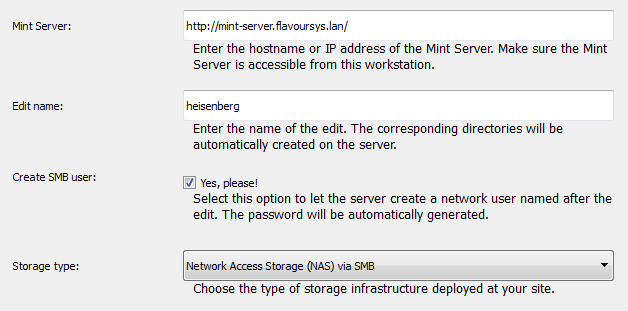
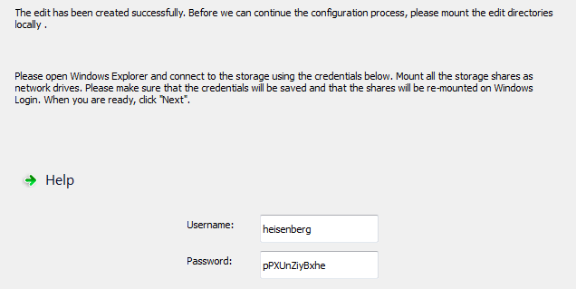
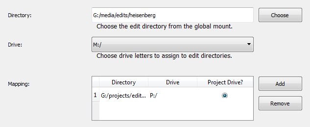

###########################
Configuring the Mint client
###########################

After you have completed the setup of the |product| server, you will need to install 
and configure the |product| client on each of your editing stations. 

*************************
Download and installation
*************************

Open your web browser of choice and enter the IP address or hostname of the |product| server 
in the address bar, followed by ``/download``, for example ``http://192.168.0.10/download``. 
The server will automatically send you the correct installer program for your operating 
system. Open the installer and complete the installation procedure as usual. After the 
installation has finished, fire up the client application to start the configuration.

.. note:: 
  The server determines your operating system based on the web browser's ``USER_AGENT``
  setting. If it fails to deliver the installer, you can also find it in the ``setups``
  directory within the server installation directory.

*****************************************
Initial Configuration (Microsoft Windows)
*****************************************

To start the client, choose **Mint Client** from the **FlavourSys** folder in the 
Windows start menu. Since the client has not been run before, this will automatically 
bring up the configuration wizard, which will guide you through the configuration 
process.

===================
Basic Configuration
===================

On its first page, the wizard will ask you for some basic settings. Apart from the 
explanations in the wizard itself, please adhere to the following standards:

:Edit name: The edit name should be unique among all edit stations. It is advisable 
  to come up with some continuous naming scheme for your edits, if you do not already 
  have one. Edit names may only consist of (Latin) characters, numbers, and underscores.

:Create SMB user: In case you have a NAS storage solution, the Mint server can 
  automatically create a SMB user for you, using the edit's name as the username. 
  The randomly generated password will be sent back to the client in the next step. 
  If you need to manage SMB users yourself or are using a authentication-less setup, 
  please uncheck this option.

.. _fig-basic-configuration-windows:

  Basic Configuration

==========
Edit Setup
==========

After the edit has been created successfully, the wizard will continue to the **Edit 
Setup** page. It is now time to mount the edit share directories from the storage 
as network drives on the client.

- In a NAS environment, go to the Windows Explorer and select **Map Network Drive** 
  from the **Tools** menu. In the dialog window, select **Browse** and click on the 
  IP address or hostname of the Mint server. You will now be asked for your username
  and password, please make sure to select **Remember credentials** here. Once 
  you entered your credentials, a list of network shares will appear underneath 
  the server entry. Select one of them and assign it a drive letter. Make sure 
  to select **Reconnect at logon** before finishing the setup.
  Repeat the process until all shares are mounted. Usually, you will have to mount 
  at least one media share and the project share.

- In a SAN environment, use the SAN manufacturer's provided tools to create a persistent
  global mount of your storage. Use any of the available drive letters but those 
  that you want your project and media shares to use, as the Mint client will automatically
  map the edit directories from the global mount to these drives for you.

.. _fig-edit-setup-windows:

  Edit Setup

.. note::
  It is important that you use the same drive letters for the network 
  shares on all edits, as your editing projects will only be able to find referenced
  media files if the the filesystem paths stay consistent. ``M:`` and ``P:`` for 
  media resp. project share have proven to be a very intuitive configuration.

==================
Edit Configuration
==================

After the mounts have been created, you need to inform the Mint client about the 
new local setup. In a NAS-based environment, you only need to select which of your 
newly-created network drives is the project drive, and which network drives are 
the media drives. Please make sure to not forget any of them, as the Mint client 
will refuse to work if it does not have access to all shares.

.. _fig-edit-configuration-windows:
.. figure:: images/edit_configuration.png
  :align: center
  :alt: Edit Configuration

  Edit Configuration

In a SAN environment, you now have to specify which directories from the global 
mount should be mounted as local drives by the Mint client. For this purpose, browse
to the ``projects/edits/editname`` directory on your global mount, select a 
drive letter (e.g., ``P:``), and click **Add**. Repeat this process for all the 
media shares. Finally, indicate which one is the project share by selecting the 
corresponding radio button in the table at the bottom.

.. _fig-edit-configuration-san-windows:

  Edit Configuration (SAN)

**************************************
Initial Configuration (Apple Mac OS X)
**************************************

To start the client on Mac OS X, you can hit the Apple button and spacebar simultaneously 
to open the quick start bar (top right corner). Type **Mint Client** here.

.. note::
  In case the Mint Client does not show up in the quick start bar (indexing may 
  take some time), you can also find it in the ``Applications`` directory.

===================
Basic Configuration
===================

