.. _index_miscellaneous:

#############
Miscellaneous
#############

**********************
Working with Templates
**********************

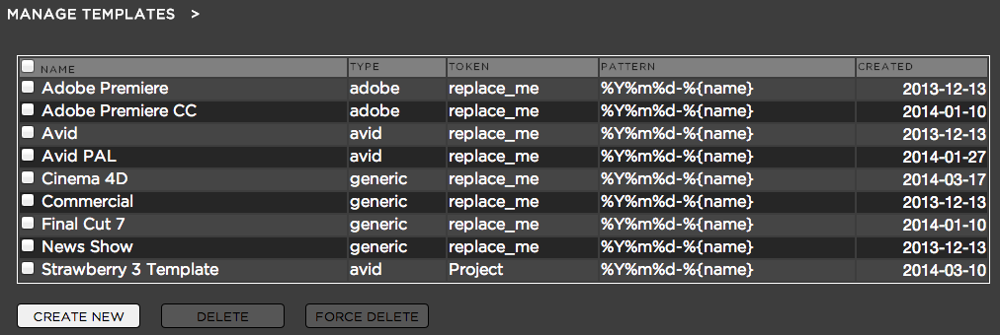

**Purpose:** Templates are an extremely efficient way to prepare standardized project settings and content  for all Strawbery users in your facility. Templates can contain custom file and folder structures.

**Example 1:** Application Specific Templates

One example to illustrate the benefit of templates can be working with Avid Media Composer in different frame rates (24 frames and 25 frames). Avid does not allow to switch the frame rate within a project. With Strawberry you could create two templates, one for 24 frames and one for 25 frames and copy the related Avid project files into this template. When a user creates a project from on of these templates, the corresponding projects files (24 frames or 25 frames) will be copied into the new projects an renamed after the new project so the user does not need to create a new Avid project manually after he or she created a project in strawberry.

**Example 2:** Production Specific Templates

Another example of working with templates can be a specific production that requires specific preparations. Most media facilities create individual folder structures for different productions so that people save graphics, visual effects and sound effects in the right location on the storage. Usually these folder structures need to be recreated for each episode of a production. With Strawberry you can create a template which contains a specific folder structure and even media files and copy your prepared folder and media files into this template. As soon as a user chooses the template upon project creation the folders and files that you prepared in the template will be copied over to the new project and are immediately available for the user.

*****************************************
Creating a Template (Avid Media Composer)
*****************************************

Before users can create any Avid projects using the Strawberry client software you need to have at least ONE template. Log into the admin panel and click on the "MISC" tab. Expand the "TEMPLATES" bar. Now click the "CREATE NEW" button.
 
Strawberry will ask you for a Template name, a preset, a token and a naming pattern.
 
Choose a name that best characterizes your template. In this example we will create an Avid template that contains a high definition Avid project with a resolution of 1080p. So it makes sense to call the template "Avid 1080p"
 
In the "preset" row click on the little "down arrow" and choose the "Avid" preset. When a user creates a project based on an Avid template, Strawberry automatically create the Avid MediaFiles and OMFI MediaFiles folder structure in the project and it will also ensure that Avid project and media files can be shared properly.
 
The token is a replacement string for a file name. This means that if your token says "replace_me" and you create an Avid template named "replace_me" and copy it into your template folder (discussed later), every time the template "replace_me" is used the token text (in this case "replace_me") will be changed to the name of the current Strawberry project . So the Avid project file called "replace_me.avp" in your templates folder will be used and named "projectname.avp" as it's created in your Strawberry project.
 
In the row "pattern" you can define how a project name based on this template should look.  The string "%Y%m%d-%{name}" will result in the project name "20130810-ProjectName". Putting the date inside the project name will enable your user to search for projects by typing in the date.  If you don't need the date in the project name you can simply delete the date-related parts of the string and
leave the "{name}" piece. If you need the date part you can modify it to your requirements. In order to understand the formatting for doing this please refer to the unix time man page at http://unixhelp.ed.ac.uk/CGI/man-cgi?date

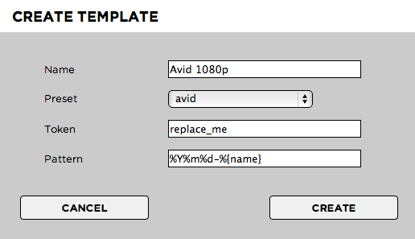

After you are done click "Create" and then open Avid Media Composer. Create a new local project called "replace_me" with the setting 1080p25.

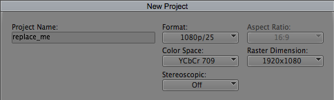

Open the newly created project, delete the bin that Avid always makes in new project and empty the Avid trash folder.
 
In order to ensure that Media Composer will recognize network volumes as media drives open Tools > Console and type in "alldrives" If you see the message "All drives will be viewed as media drives. (Was previously set to having only true media drives act as media drives.)" you are good to go. If you see the message "Only true media drives will be viewed as media drives. (Was previously set to having all drives act as media drives.)" type "alldrives" again. There are just two possible options.

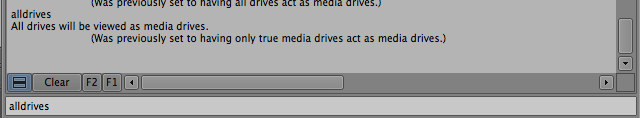

Now go to "Tools" > "Media Creation" > "Capture" and select the Strawberry media drive (mapped as a network drive on your Computer) as the Audio/Video file destination. Click on both "Apply to All" buttons and then click on "OK". Now close the project.

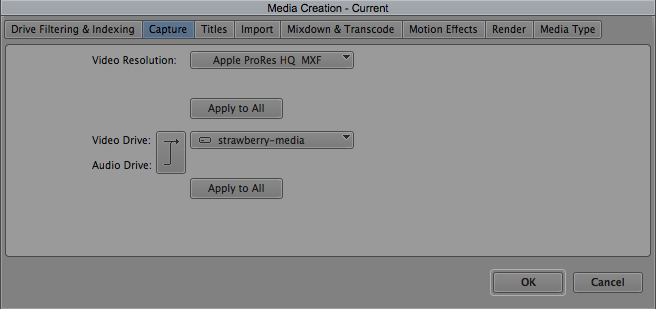

Navigate to the Strawberry "template" folder on your storage (\Strawberry\templates). Within that template folder you will see a folder that is named after the template you created in the Strawberry admin panel (in this case we called it Avid 1080p). Inside this folder will be a folder called "media_1" and one called "projects".

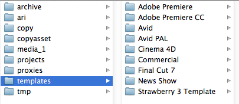

Use the "Finder" or "Explorer" to navigate to your local Avid projects folder (e.g. \Users\FlavourSys\Documents\Avid Projects) and open the replace_me project folder. Copy the files "replace_me.avp", "replace_me Settings.xml" and "replace_me Settings.avs" to your clipboard. 

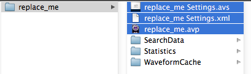

Paste the files into your "\Strawberry\templates\Avid 1080p\projects" folder. If an editor creates a new project using this template, Strawberry will rename the "replace_me" string with the name of the current Strawberry project.
 
Now every time a Strawberry user creates a new project based on this template it has all the right settings, export preferences etc. that it will inherit from the "replace_me" project that you created and set up before copying it into the \Strawberry\templates\<your template name>\projects folder . If you need to modify or improve your template, simply make the changes to the local "replace_me" project and re-copy the three files into the \Strawberry\templates\<your template name>\projects folder.

************************************
Creating a Template (Adobe Premiere)
************************************

Before you can create an Adobe Premiere editing project from within the Strawberry client software you need to create a template for Strawberry to use. Click on the Template Tab in the admin panel and then click on "Create New".
 
Strawberry will ask you for a Template name, a preset, a token and a naming pattern.
 
Choose a name that best characterizes your template. In this example we will create an Adobe Premiere template that contains an Adobe Premiere project. So it makes sense to call the template "Adobe Premiere"
 
In the "preset" row click on the little "down arrow" and choose the "Adobe" preset. When a user creates a project based on an Adobe template, Strawberry automatically create the Adobe Cache folder structure in the project and it will also ensure that Adobe project and media files can be shared properly.
 
The token is a replacement string for file names. This means that if your token says "replace_me" in these settings and you go on to create an Adobe Premiere project named "replace_me" and put it in your template folder, the template will be used and automatically renamed based on the Strawberry project name that is open. This way an Adobe Premiere template project file called "replace_me.PR" will be named "Strawberryprojectname.PR" each time you create a new project from within Strawberry.
 
In the row "pattern" you can define how a project name based on this template should look like.  The string "%Y%m%d-%{name}" will result in the project name "20130810-ProjectName". Putting the date inside the project name will enable your user to search for projects by typing in the date.  If you don't need the date in the project name you can simply delete the date related parts of the string and
leave the "{name}" piece. If you need the date part you can modify it to your requirements. In order to understand the formatting for doing this please refer to the unix time man page at http://unixhelp.ed.ac.uk/CGI/man-cgi?date

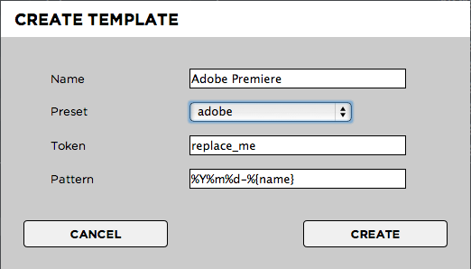

After you are done click "Create" and go to the Strawberry Client. Create a new project using the Adobe Premiere template. Now open Adobe Premiere and create a new project. Name the project "replace_me" and set the capture format to HDV. Ensure that all Scratch Disk locations are set to same as project.

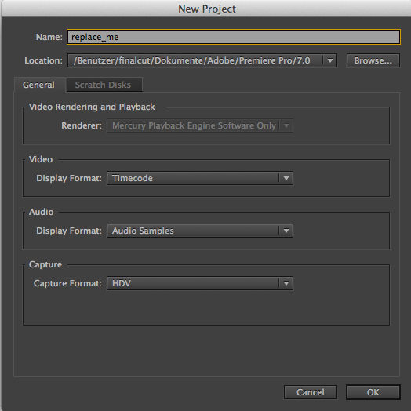

Click "ok" to create and open the project. Once the project is opened go to "Edit>Preferences Media" and choose the "Adobe Cache" on your Strawberry media volume as the destination for "Media Cache Files" and "Media Cache Database"

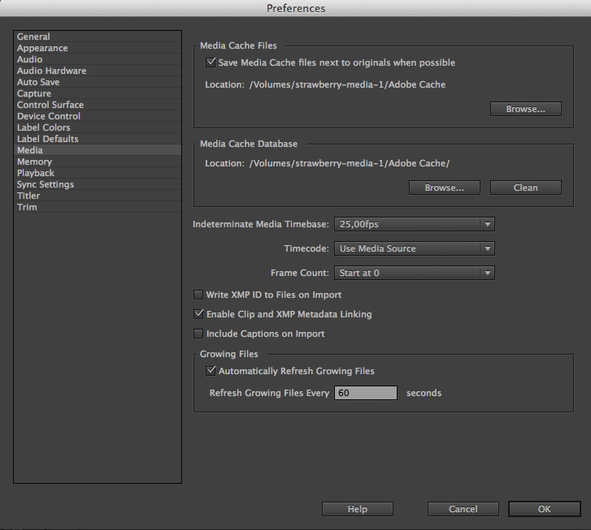

Click "OK" to confirm your changes. Now save the project and leave Adobe Premiere. Navigate to your local Adobe projects folder and copy the newly created project file "replace_me.prproj" to the "media_1" folder of the Adobe template location that you created.

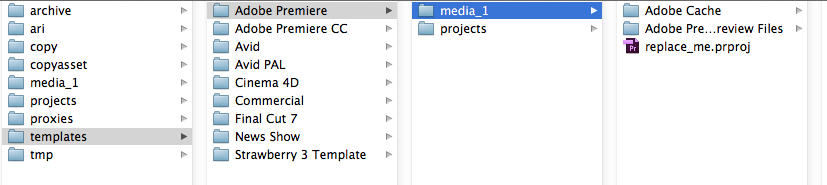

Now every time an editor creates a new project using the "Adobe Premiere" template the replace_me.pr template will be used and all the settings, preferences and destinations will be inherited and used in the new Strawberryprojectname.pr. 

*************
Storage Quota
*************

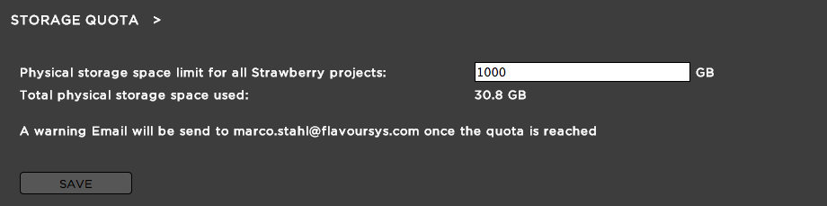

**Purpose:** In this section you can define how much physical storage space all projects managed by strawberry are allowed to occupy. The quota is a soft quota, meaning that there is no physical storage restriction once it gets expired. However, Strawberry will send a warning email if if the quota that you defined has been reached.

**Usage:** Log into the admin panel and click on the "MISC" tab. Expand the "STORAGE QUOTA" bar. Define how much space (in Gigabytes) all projects managed by strawberry are allowed to occupy and press "SAVE". You can change this quota at any time.

************
MYSQL Backup
************

Explanation Pending

******************
Versions & License
******************

This section is for license and support purpose only.
