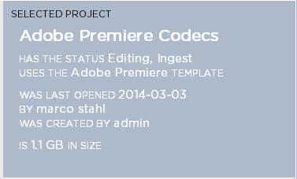
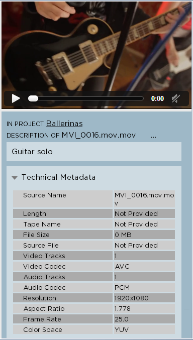

.. _index_miscellaneous:

########################
Project & Asset Metadata
########################

Strawberry 4 automatically generates technical metadata for editing projects and media assets but it also allows you to provide your own user-generated metadata to these objects.

****************
Project Metadata
****************

Strawberry collects and manages certain metadata for each projects These metadata include:

* Project Name
* Project Template (Information about on which template a project is based)
* Project Description (The description of a project)
* Project Size (The physical storage size of a project)
* Access Information (Information about who created the project and who opened it last)
* Access Rights (the accessibility of a project for certain users and teams) 
* Project Status (The "work in progress" status of a project)
* Visual Presentation of Projects (As described in section X)

**************
Asset Metadata
**************

Strawberry collects and manages certain metadata for each asset. These metadata include:

* Asset Name
* Proxy File (A low resolution file for preview purposes)
* Asset Description (The description of an asset)
* Asset Size (The physical storage size of an asset)
* Technical Metadata (Metadata that include the video/audio format, codec and similar)

