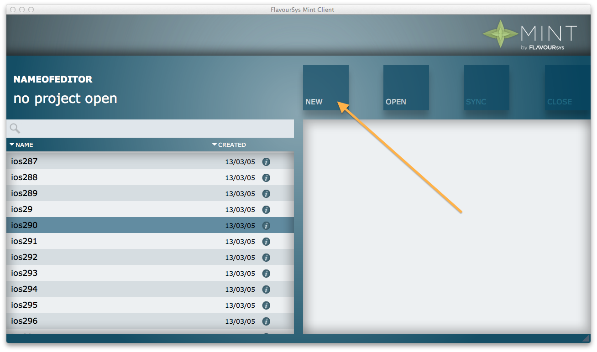
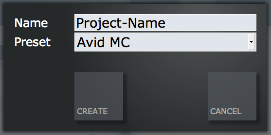

.. FlavourSys Strawberry documentation usage: create project (Mint),
   created by Mick on 15.03.2013 09:45
.. _usage_project_create:

****************
Create a project
****************

To create a new project, open the Mint Client and click on the "new" button.

In the newly opened window, enter the name of the project in the "Name" field and select the preset template from the "Preset" dropdown.

After clicking on "Create", the project is created and automatically opened.  Just switch to the editing application and load the files from the corresponding share.

*The following errors could occur:*

#. :ref:`Error_110`
#. :ref:`Error_111`
