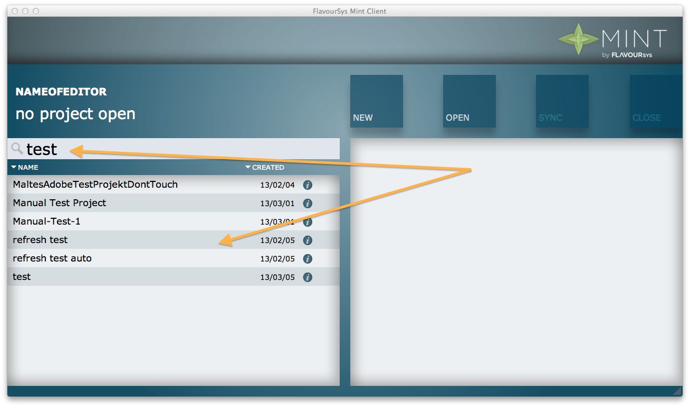
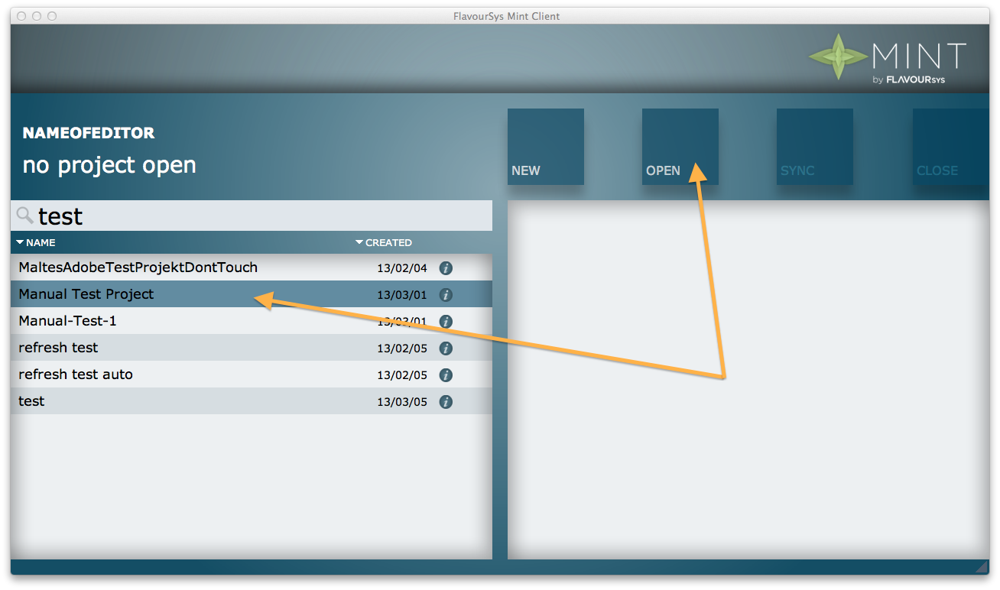

.. FlavourSys Strawberry documentation usage: open project (Mint),
   created by Mick on 15.03.2013 09:45
.. _usage_project_open:

**************
Open a project
**************

To open an already existing project, either search for it using the search input field, or directly select it from the project list.

Select the project by clicking on the name in the project list and after clicking on the open button the project will be loaded and the files will be made available in the mounted shares.

Switch to the software and open the project files from the corresponding share.

*The following errors could occur:*

#. :ref:`Error_110`
#. :ref:`Error_111`

