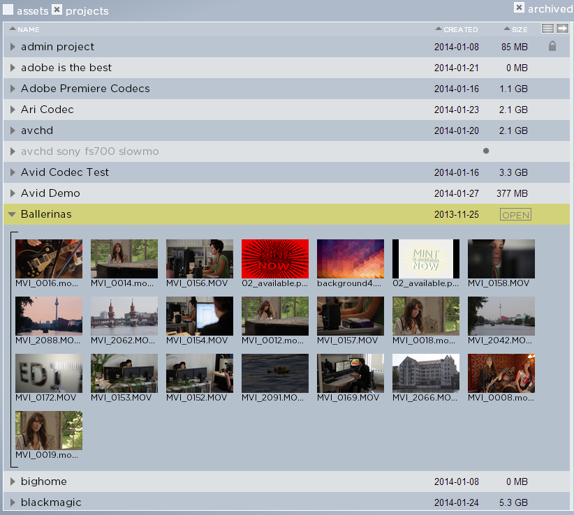

.. _index_projectlist:

########################
The Project & Asset Pane
########################

The Project Panel lists every single editing project that you have access to and it lets you sort projects by different criteria. It also indicates the current status of a project.

***********************
Visual Presentation of Projects
***********************

Strawberry 4 provides you with a list view for editing projects. Each row contains the project name, the creation date, the project size and additional visual information showing the current state of a project. Project states can be "online", "locked", "being archived", "being retrieved", archived and frozen.

	Projects displayed like this are online and ready to open.

	Projects displayed like this are online but locked by another computer. Hover the lock icon to see by which computer it is currently locked.

.. figure:: images/project-to-be-arhived.png
	:align: center
	:alt: Project to be Arhived

	The dot animation shows that a project is just on its way to the archive (animation moves left to right) or is currently being retrieved from the archive (animation moves right to left)

	This project is in the archive. Its name is grayed out and it has a grey dot right to the project size.

.. figure:: images/frozen-project.png
	:align: center
	:alt: Frozen Project

	This project is frozen. Its name is grayed out and it has a grey snowflake right to the project size.

***********************
Sorting Projects and Assets
***********************

Within the Project Pane, you can sort projects by 

* Project/Asset Name (Name)
* Physical Size (Size)
* Creation Date (Created)

To sort your projects or assets based upon one of these criteria enable the "projects" checkbox below the search field (disable the "assets" checkbox) and click on "Name", "Size" or "Created". If you sort by one of these values click the value again to reverse the order of the search results in an Ascending or Descending manner.

***********************
Expanding/Contract Project Pane
***********************

To see the asset content of a project in the project list click on the arrow on the left to the project name. Strawberry will load the first 150 assets of the project sorted by name. For projects containing more than 150 assets, if you scroll down the asset list you will recognize a message saying "You have reached the maximum amount of displayable assets in this view. Click "View All Assets" to switch the view." Click this button to let Strawberry load all the assets from this project. To contract the project ("hide" its assets) imply click on the arrow on the left of the project name again.

.. figure:: images/expand-project-pane.png
	:align: center
	:alt: Expanding/Contract Project Pane

***********************
Switching Between Grid View and List View for Assets
***********************

To switch between grid view (a.k.a thumbnail view) or list view (a.k.a list of names) click the button on the right to the "sort by size" column.

***********************
Expand/Contract the Project and Asset Pane
***********************

To expand or contract the project and asset pane click on the top right arrow of the left column.

.. figure:: images/expand-asset-pane.png
	:align: center
	:alt: Expand/Contract the Project and Asset Pane

***********************
Switch Between Project and Asset View
***********************

To switch between the project and the asset view just check or uncheck the "projects" and "assets" checkboxes below the search field. If both checkboxes are enabled Strawberry will show projects and assets in the list.

.. figure:: images/switch-project-asset.png
	:align: center
	:alt: Switch Between Project and Asset View
