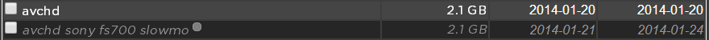
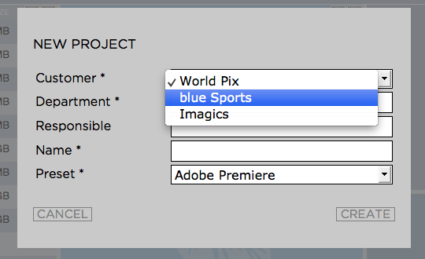
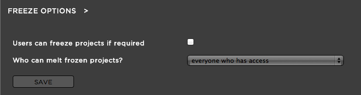

.. _index_client_manual:

########
Projects
########

***********************
Force Closing a Project
***********************
  
**Purpose:** This feature allows the administrator to close a project while it is opened (locked) by an editing system. This feature can be useful in case a computer crashes caused by a hardware failure on the editing system and it is not possible to close the project from this computer anymore. 

**Usage:** Log into the admin panel and click on the "PROJECTS" tab. Expand the "MANAGE PROJECTS" bar. Select the project that you want to force close and press the "FORCE CLOSE" button below the project list. Confirm to the warning message to force close the project.

***************************************
Deleting a Project or multiple Projects 
***************************************

**Purpose:** This feature allows the administrator to delete projects permanently. When deleting a project, project files, media files, as well as proxy files and MySQL database entries will be deleted permanently.

**Usage:** Log into the admin panel and click on the "PROJECTS" tab. Expand the "MANAGE PROJECTS" bar. Select the project(s) that you want to delete and press the "DELETE" button below the project list. Confirm to the warning message to delete the project(s).

******************************
Encoding/Re-encoding a Project
******************************

**Purpose:** The re-encode feature allows you to re-encode and entire project or to reindex it. Re-encoding means that Strawberry will delete all the existing proxy files and creates new ones from the online media files. You you do not want to re-encode the whole project but just want to have Strawberry looking for new or newly supported media use the reindex function.

**Usage:** Log into the admin panel and click on the "PROJECTS" tab. Expand the "MANAGE PROJECTS" bar. Select the project that you want to Encode/Re-encode and press the "ENCODE" button below the project list. Select "Reencode Everything" and confirm.

********************
Reindexing a Project
********************

**Purpose:** Besides re-encoding editing projects Strawberry also allows you to reindex them. There are multiple use cases for this feature such as:

* Projects which were created and media files which were ingested when VIEW was not installed or not running. Usually VIEW indexes projects and their related content as soon as they are opened, updated or closed. When you disable VIEW at a later point it will not scan old projects automatically but waits until they get opened (selective indexing). This prevents the storage from being overloaded with index jobs. Reindexing these projects will trigger VIEW to index and encode their related media content.

* To take advantage of support for new codecs as they become available. As FlavourSys releases an update that supports additional file formats, instead of having to re-encode entire projects, including all the supported file formats which already have been encoded, you can simply reindex the project. In this case Strawberry only looks for newly supported media files and send them to the encoding queue.

Log into the admin panel and click on the "PROJECTS" tab. Expand the "MANAGE PROJECTS" bar. Select the project that you want to Reindex and press the "ENCODE" button below the project list. Select "Just Reindex" and confirm.

******************
Archiving Projects
******************

**Purpose:** Strawberry allows certain users (admins & users but not guests) to archive and retrieve editing projects. When performing an archive operation Strawberry takes every single file which is part of the project and sends it to an archive destination which was previously defined by the administrator. As soon as the project is in the archive Strawberry 4 will delete it from the "production storage" (a.k.a source) but will keep the metadata and proxy files. Please keep in mind that Strawberry does not archive subprojects which are added to the projects that you want to archive. If you you want to archive project "A" which has subproject "B" and in case project "A" actually uses media files from subproject "B" please make sure to consolidate or copy the affected media files to project "A" before sending it to the archive. This will ensure that all the used media files will be archived properly and that the project will be fully operational after retrieval. To check which projects are related to one another just select a project and check the "PARENT PROJECTS / SUB PROJECTS" list on the right of the project list.

**Usage:** Log into the admin panel and click on the "PROJECTS" tab. Expand the "MANAGE PROJECTS" bar. Select the project(s) that you want to archive and press the "ARCHIVE" button below the project list. Choose an "Archive Strategy" from the list and confirm. As soon as the project is in the archive it will change its visual appearance as following:

	The project "avchd" is online while the project "avchd sony fs700 slowmo" is in the archive. Archived projects are a bit greyed out and have a grey dot next to their 	project name.

*******************
Retrieving Projects
*******************

**Purpose:** Strawberry allows certain users (admins & users but not guests) to archive and retrieve editing projects. In order to be able to retrieve, Strawberry has to be able to access the project's archive location. Please note, if an external archive application has moved the project, for instance off to a tape library, an integration may be necessary to trigger the restore process in the archive application.

**Usage:** Log into the admin panel and click on the "PROJECTS" tab. Expand the "MANAGE PROJECTS" bar. Select the project(s) that you want to retrieve from the archive and press the "RETRIEVE" button below the project list.The RETRIEVE/ARCHIVE button is a toggle button which is an ARCHIVE button if you select a project which is not already in the archive and becomes a "RETRIEVE" button once you select an archived project. Confirm the message to proceed. Depending on the project size the retrieval progress can take some time. Check the project list from time to time to see if the project has been retrieved. You will notice a retrieved project by its visual appearance.

	The project "avchd" is online while the project "avchd sony fs700 slowmo" is in the archive. Archived projects are a bit greyed out and have a grey dot next to their project name.

*************************
Creating Project Statuses
*************************

**Purpose:** Project statuses help users to determine what the working status of a project is. Statuses can be for instance "in editing, in color grading, etc." and are defined by the administrator. The status of each project is displayed in the metadata area of the Strawberry 4 user interface.

**Usage:** Log into the admin panel and click on the "PROJECTS" tab. Expand the "STATUS OPTIONS" bar. Now click on "ADD STATUS" and define a name for the new status. Once the status is created users can choose it from the Strawberry frontend.

***************
Custom Metadata
***************

**Purpose:** This feature allows the administrator to create metadata fields which content users have to provide  upon project creation. This content can be a simple text input or even a drop down menu. Custom metadata are also displayed in the frontend when a project is selected. 

**How the custom metadata could look in the user frontend:**

	An example of custom metadata fields asking the user to provide the requested information. Metadata fields with an asterisk symbol are mandatory for the user to fill out.

*************************
Creating a Metadata Field
*************************

**Usage:** Log into the admin panel and click on the "PROJECTS" tab. Expand the "CUSTOM METADATA" bar.

Click the "ADD VALUE" button and provide the following information:

* Name: The name of the metadata field (for example: Customer)
* Type: Text Input or drop down menu
* Maximum Characters: Defines how much characters the user can type into this field. Zero means that the amount of characters is unlimited. Text input does not work for dropdown menus.
* Mandatory: Defines if this value is mandatory (checked) or not (unchecked)
* Select field options: Define the drop down values from which the users can choose. Click "+" to add more values or "-" to remove existing values.

************************
Editing a Metadata Field
************************

**Usage:** Log into the admin panel and click on the "PROJECTS" tab. Expand the "CUSTOM METADATA" bar. Select the metadata field you want to edit and click the "EDIT VALUE" button. Change the field and value properties as required and then click "CONFIRM".

*************************
Deleting a Metadata Field
*************************

**Usage:** Log into the admin panel and click on the "PROJECTS" tab. Expand the "CUSTOM METADATA" bar. Select the metadata field you want to delete and click "DELETE VALUE".

**************
Freeze Options
**************

**Purpose:** The "Project Freeze" feature enables users to put projects "on hold". By freezing a project the user indicates that she or he does not want other users to modify the content of the frozen project. Per default frozen projects are accessible (meltable) for everyone. However, administrators can define that frozen projects can only be melted by the person who froze it or by an administrator. For instance: if an editor wants to continue working on a project from home, he can drag the project and media files file onto a portable drive, freeze the project, and then continue to work at home. The next day, simply 'melt' the project and drag the project and media files back to the proper location in Strawberry to enable others to continue working on it.

**Usage:** Log into the admin panel and click on the "PROJECTS" tab. Expand the "FREEZE OPTIONS" bar. Here you can select from the following options:

* "Users can freeze projects if required": Selecting this checkbox enable the feature for users  (except guest users).
* "Who can melt frozen projects?": Here you can define if a frozen project can either be melted by everyone who has access or just by the person who froze it in the first place and an administrator.
