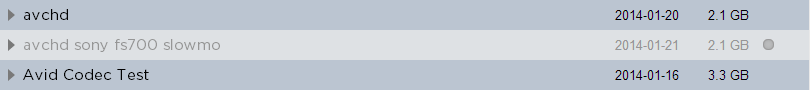

.. _index_search:

################
The Search Field
################

.. figure:: images/search-field.png
	:align: center
	:alt: The Search Field

*******
General
*******

The Strawberry search function is designed to make search operations as efficient and fast as possible. You need to type at least three characters into the search field for the instant search to start. The search function allows you to search for:

* Project Names
* Project Descriptions
* Project Naming Conventions
* Media & Non-Media Assets
* Media & Non-Media Asset Descriptions

**********************
Searching for Projects 
**********************

To search for an editing project enable the **"projects"** checkbox below the search field and type your search criteria into the search field. Projects which have the search criteria in their **name**, **naming convention** or **description** will be displayed in the list below the search field.

********************
Searching for Assets
********************

To search for media or non-media assets enable the **"assets"** checkbox below the search field and type your search criteria into the search field. Assets which have the search criteria in their **name** or **description** will be displayed in the list below the search field.

*************************************
Combined Search for Projects & Assets
*************************************

To search for projects, assets and their related metadata simultaneously enable the "projects" and "assets" checkboxes below the search field and type your search criteria into the search field.
Strawberry will now display matching search results for both projects and assets. For a better overview projects and assets are divided by a dotted line in the search results.

.. figure:: images/combined-search-results.png
	:align: center
	:alt: Combined Search Results

	How assets and projects are visually divided in the combined search results

*******************************************************
Include/ Exclude Archived Projects & Assets from Search
*******************************************************

To include or exclude archived projects or assets from search, enable or disable the "archived" checkbox below the search field. You can recognize archived projects by their greyed-out font and the gray dot to the right of the item. You can recognize archived assets by their greyed-out name.

	An archived project is in between two online projects.

************************
Boolean Search Operators
************************

Boolean searching is built on a method of symbolic logic. Boolean search techniques can be used to carry out effective searches, cutting out many unrelated documents. Strawberry supports the following boolean search operators:

* **AND ([SPACE])**
	Using [SPACE] (AND) narrows a search by combining terms; it will retrieve objects that use both
	the search terms you specify, as in this example:

	"Portland [SPACE] Oregon"
	"Footage [SPACE] Berlin"
	"Elvis [SPACE] mp3"

* **OR (or)**
	Using OR broadens a search to include results that contain either of the words you type in. OR is a good tool to use when there are several common spellings or synonyms of a word, as in this example:

	"liberal or democrat"
	"wav or mp3"
	"ocean or sea"

* **NOT (-)**
	Using NOT will narrow a search by excluding certain search terms. NOT retrieves documents that contain the first, but not the second, of the search terms entered, as in this example:

	"Oregon - travel" 
	"Music - Wav" 
	"Ocean - Fish"
