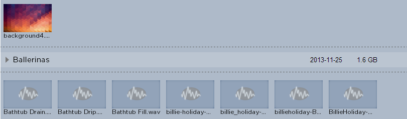
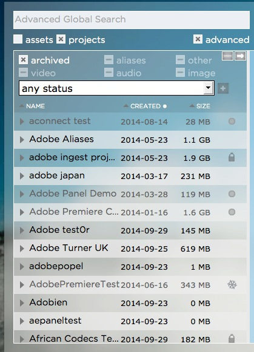

.. _index_search:

################
The Search Field
################

*******
General
*******

The Strawberry search function is designed to make search operations as efficient and fast as possible. The search function allows you to search for:

* Project by Names
* Project by Descriptions
* Project by Statuses
* Project by Custom Metadata
* Project by Creator

* Media Assets by Name
* Media Assets by Description
* Media Assets by Extension
* Media Assets by Technical Metadata
* Media Assets by the Name of Their Related Project
* Non-Media Assets

**********************
Searching for Projects 
**********************

To search for an editing project enable the **"projects"** checkbox below the search field and type your search criteria into the search field. Projects which have the search criteria in their **name**, **naming convention** or **description** will be displayed in the list below the search field.

**********************
Searching within Projects
**********************

In order to search for assets within a project expand the project by clicking on the arrow key left to the project name. Once the project is expanded you will see a text field called "Search this Project". Once you enter something into this text field Strawberry will start searching with this project.

********************
Searching for Assets
********************

To search for media or non-media assets enable the **"assets"** checkbox below the search field and type your search criteria into the search field. Assets which have the search criteria in their **name** or **description** will be displayed in the list below the search field.

*************************************
Combined Search for Projects & Assets
*************************************

To search for projects, assets and their related metadata simultaneously enable the "projects" and "assets" checkboxes below the search field and type your search criteria into the search field.
Strawberry will now display matching search results for both projects and assets. For a better overview projects and assets are divided by a dotted line in the search results.

	How assets and projects are visually divided in the combined search results

*************************
Filtering Search Results
*************************

If you are for looking for something very specific search filters are a great help to further reduce search results. Applying the proper filters you could exclude e.g. archived projects or specific file types from your search results. It is also possible to just display projects matching a specific status (e.g. just displaying projects which are in color grading).

	

************************
Boolean Search Operators
************************

Boolean searching is built on a method of symbolic logic. Boolean search techniques can be used to carry out effective searches, cutting out many unrelated documents. Strawberry supports the following boolean search operators:

* **AND ([SPACE])**
	Using [SPACE] (AND) narrows a search by combining terms; it will retrieve objects that use both
	the search terms you specify, as in this example:

	"Portland [SPACE] Oregon"
	"Footage [SPACE] Berlin"
	"Elvis [SPACE] mp3"

* **OR (or)**
	Using OR broadens a search to include results that contain either of the words you type in. OR is a good tool to use when there are several common spellings or synonyms of a word, as in this example:

	liberal [SPACE] democrat
	wav [SPACE] mp3
	ocean [SPACE] sea

* **NOT (-)**
	Using NOT will narrow a search by excluding certain search terms. NOT retrieves documents that contain the first, but not the second, of the search terms entered, as in this example:

	"Oregon" - "travel" 
	"Music" - "Wav" 
	"Ocean" - "Fish"
