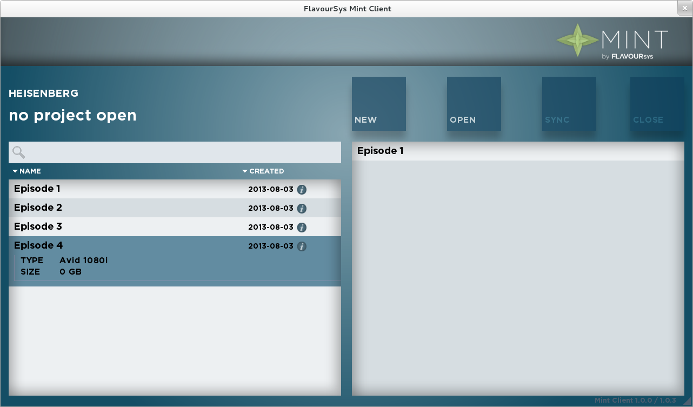

.. role:: client_ui_button(strong)

**************
User Interface
**************

.. _fig-mint-ui:

  The Mint user interface

-------------------
The search function
-------------------

Use this function to search for projects. The Mint search is a boolean search
meaning that you can combine keywords by putting one after another divided by 
a space. You can search for the project name that was defined when creating 
a project.

--------------------
Create a new project
--------------------

Use this button to create a new Mint project. Fill in the project name, select
a template and click :client_ui_button:`CREATE`.  Remember: The more meaningful the project name
is, the better the search results will be later. After you clicked on
:client_ui_button:`CREATE`, Mint will automatically create and open the project.

------------------------
Open an existing project
------------------------

Choose a project from the project list and click :client_ui_button:`OPEN` to open it. Once the 
*Please Wait* animation disappears you are free to open the project in your 
editing application.

----------------
Add a subproject
----------------

To use material from another project you can add it as a so called sub project.
Sub projects are always read only. In order to add a sub project you need to
open a project first. To add a project as a subproject select a project from
the project list and click the :client_ui_button:`+` button next to the project name. 

-------------------
Remove a subproject
-------------------

In order to remove a sub project from a project you need to open the project first.
After you opened the project select it in the project list. You will see its subprojects
in the right column of the user interface. Selct the sub project you wish to remove and 
click the :client_ui_button:`-` button.

---------------------------
Refresh the current project
---------------------------

Use the :client_ui_button:`REFRESH` button to sync your projects progress  (project & media files) with 
the central storage. This function will also refresh the content of the sub projects 
that you added. The auto refresh function is set to 3 minutes. 

---------------
Close a project
---------------

Click this button to close the opened Mint project. Make sure to close the project 
in the editing-application before you close the project in Mint.
