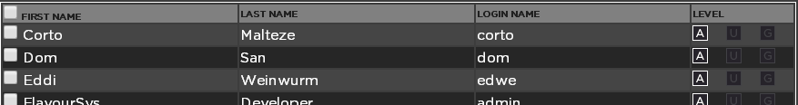
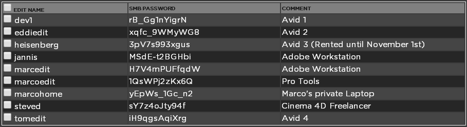

.. _index_users:

#####
Users
#####

**************
Creating Users
**************
  
Log into the admin panel and click on the "USER" tab. Expand the "MANAGE USERS" bar. Below the user list is a button that says "ADD USER" Click this button and fill out the required information. During this process strawberry will ask you for the "user level" of the user that you'll create. It provides the following user levels:

* Administrator: Can see and do see any project from any user & team, can assign projects to other teams, can archive and retrieve projects, can freeze and melt projects
* User: Can only see projects from teams that he or she is a member of, can assign projects to other teams, can archive and retrieve projects, can freeze and melt projects
* Guest: Can only see projects from teams that he or she is a member of, can not assign projects to other teams, can not archive and retrieve projects, can not freeze or melt projects

****************
Deleting a User
****************

Log into the admin panel and click on the "USER" tab. Expand the "MANAGE USERS" bar and select the user you want to delete using the checkbox next to the username. Click the delete button and confirm the deletion.

*************************
Assigning a User to Teams
*************************

**Purpose:** Per default newly-created users can only see their own projects but are not assigned to any specific teams. Here you can create teams and assign users to those teams so that their projects will always be available to their team members. 

For Example: Editors A, B, and C and the Production Director are working together on the popular series "Making Mad." Editors C, D, and E and the Production Director will work together on the new season of "Game of Chairs." Simply create teams for Making Mad and Game of Chairs, and assign Editor C and the Production Director to both teams, and they will be able to collaborate and view all projects for both teams. Editors A, B, D and E will only be able to view content for their respective teams. 

**Usage:** Log into the admin panel and click on the "USER" tab. Expand the "MANAGE USERS" bar. In order to put a user into a team select the user. Now you can see a list on the right to the user list, named "The selected user is a member of these teams". You can assign the user to one or more of these teams by simply checking the box on the left of the team name. Now when the user logs into the Strawberry 4 user interface he or she will be able to see the projects from all the teams to which he belongs. When the user creates a project this project will automatically be visible for all the members of his teams. The level of access rights for a particular project can be readjusted in the Strawberry user front end by the user him/herself or by an administrator. 

**************************
Removing a User from Teams
**************************

Log into the admin panel and click on the "USER" tab. Expand the "MANAGE USERS" bar. In order to remove a user from a team select the user. Now you can see a list on the right to the user list. This second list is named "The selected user is a member of these teams". You can remove the user from one or multiple of these teams by unchecking the box on the left of the team name. 

Example: Freelancer John Smith has been helping with Game of Chairs production and his contract is finished. The admin removes John Smith from the Game of Chairs team to ensure that he no longer has access to those projects, but leaves John Smith as a user in the system for future collaboration.

***************
Creating a Team
***************

**Purpose:** Users can share projects with other users but in some cases it is more efficient to share projects with an entire team. If a user creates a project, that project is automatically visible to the user and the teams that he or she is a member of.

**Usage:** Log into the admin panel and click on the "USER" tab. Expand the "MANAGE TEAMS" bar. Below the  teams list is a button that says "ADD Team. Click this button and fill out the required information. During this process strawberry will ask you to set a team's storage quota. The team quota virtually limits the storage space but without restricting write access once a team has reached it. In Strawberry no project has a real owner. For this reason the teams quota is a so called additive quota which means that a project that is visible to multiple teams will influence the quota of each of these teams. This also means that the **additive** quota differentiates from the physical (real) storage quota which can be configured in "MISC>STORAGE QUOTA".

**********************
Changing a Team's Name
**********************

Log into the admin panel and click on the "USER" tab. Expand the "MANAGE TEAMS" bar. Select the team you want to edit and then click the "EDIT TEAM" button. Change the team name and confirm.

***********************
Changing a Team's Quota
***********************

Log into the admin panel and click on the "USER" tab. Expand the "MANAGE TEAMS" bar. Select the team you want to edit and then click the "EDIT TEAM" button. Change the teams quota and confirm.

***************
Deleting a Team
***************

Log into the admin panel and click on the "USER" tab. Expand the "MANAGE TEAMS" bar. Select the team that you want to delete and press the "DELETE" button below the teams list. Confirm the message. Please note that projects that were exclusively visible to this team should be reassigned to other users or teams before deletion.

**************
Managing Edits
**************

The "Manage Edits" list shows you which editing systems (computers) have been created by Strawberry. Each of the "edits" represents a computer in your facility that that is known to Strawberry.

****************
Creating an Edit
****************

Creating edits is currently not supported in the Strawberry admin panel. It has to be done during the client installation using the Strawberry install wizard.

****************
Deleting an Edit
****************

Log into the admin panel and click on the "USER" tab. Expand the "MANAGE EDITS" bar and select the dit that you want to delete. Now press "DELETE EDIT" and confirm.

*****************************
Writing a Comment for an Edit
*****************************

**Purpose:** Commenting on edits is helpful if, for instance, the edit name does not say anything about the edit's location or if one of your edits is a rental system. One could use the comment fields to either write a comment about the edits location (for instance "Room 42") or about the rental status of the edit (for instance "Rented until December 20th").

**Usage:** Log into the admin panel and click on the "USER" tab. Expand the "MANAGE EDITS" bar. Select the edit that you want to comment on and press the "EDIT" button below the edits list. Change the comment and confirm.
