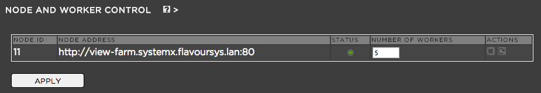

.. _index_installation:

####
VIEW
####

**************************************
Supported audio and video file formats
**************************************
  
Please put the list here:

**************************
Enabling or Disabling View
**************************

Log into the admin panel and click on the "VIEW" tab. If VIEW is enabled proxy files will be created automatically based on the criteria below. If VIEW is disabled proxy file encoding will not take place and he user front end automatically jumps to list view instead of thumbnail view. 

***************************
Proxy Encoder Configuration
***************************

.. figure:: images/proxy-encoder-configuration.png
	:align: center
	:alt: Proxy Encoder Configuration

In this menu you can choose from properties regarding the proxy files. These options include:

* Proxy File Location: Define where Strawberry VIEW saves the proxy files that it generates. You can not change this path at the moment but we are working on it.
* Blacklist: Blacklist any file extensions that you do not want to have recognized by Strawberry VIEW. Blacklisted files will not be searchable in the front end, so use this feature wisely.
* Bitrate: Define the proxy bitrate (per second). Please keep in mind that lower bitrates might be more suitable for users connecting over the Internet while higher bit rates are good for LAN operations. Is there a golden rule? Unfortunately not.
* Resolution: Choose a resolution for your proxy files. There should always be a coherence between the resolution and the bitrate. For example: A 1920x1080 proxy file should have a bitrate of at least ~1200k while a 640x360 proxy should look good with a 600k bitrate. 
* Image Sequence Recognition: When Strawberry VIEW detects an image sequence (Basename & Count) it will create a preview MP4 file out of it.
* Time Code Burn-In: If you wish to have a video time code burned into your proxy files you should enable this feature.

***********************
Node and Worker Control
***********************

**Purpose:** In this section of the admin panel you monitor and change the status of each VIEW encoding node that is integrated in your environment. 

**Usage:** Log into the admin panel and click on the "VIEW" tab. Expand the "NODE AND WORKER CONTROL" bar. Here you can select from the following options:

* NODE ID: The internal ID of each encoding node
* NODE ADDRESS: The hostname or IP address and port under which each node can be reached
* STATUS: Green means "running", red means "not running"
* NUMBER OF WORKERS: Number of encoding workers (threads) that work at the same time. Choose the amount of workers based on the amount of CPU cores of each node. One worker per core works very well but leave at least one core for the OS and the rest of the Strawberry system. The Strawberry Server license comes with 3 Workers, additional workers must be licensed separately.
* Actions: Stop, start or restart individual nodes

************************
Content Download Options
************************

**Purpose:** If you want to allow user to download media assets using the front end, you can define this here. For instance, for workflows requiring executive review or for film schools where faculty could grade from home, this feature can be beneficial, however, for feature film workflows, this feature can be turned off.

**Usage:** Log into the admin panel and click on the "VIEW" tab. Expand the "CONTENT DOWNLOAD OPTIONS" bar. If you want to enable users to download low resolution media files (proxy files) from the front end, check the box next to "Allow users to download proxy  files". If you want to enable users to download high resolution media files from the front end, check the box next to "Allow users to download high-res files"

