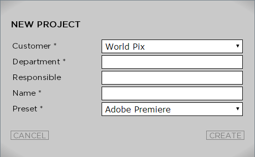
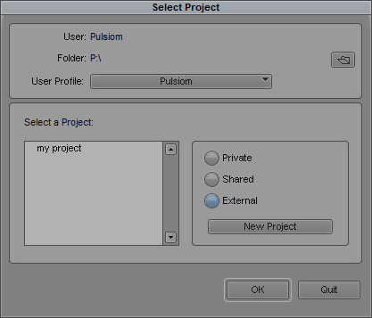
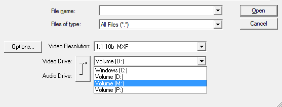
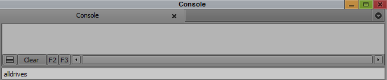
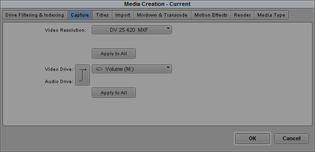
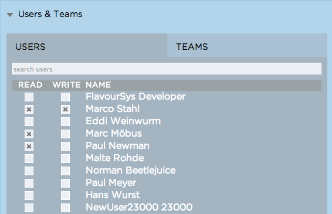
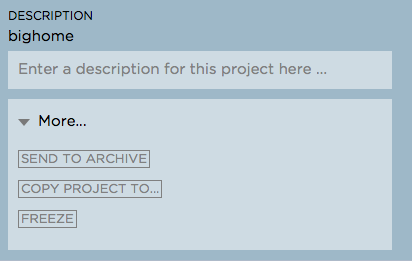

.. _index_view:

#####################
Working with Projects
#####################

**********************
Creating a New Project
**********************
  
In order to create a new project click the "NEW" button on the top right of the Strawberry 4 user interface. A window asking you for additional project matdata will show up. Fill out the fields required (defined by the admin) and choose a project name and a template. Keep in mind that the name should be as meaningful as possible in order to make it easier for you and others to find the project later. Choose the template that fits best to your project requirements or ask an administrator which template you should select. Click "CREATE" in order to create your new project.

	Example of a "create new project" window in Strawberry 4. Values with an asterisk (*) are mandatory.

After the project is created you will see the projects name in the top left corner of the Strawberry 4 user interface indicating that the project is opened.

*****************
Opening a Project
*****************

Select the project you want to open in the project list and click either the "OPEN" button on the right to the project name, the "OPEN" button on the top right of the user interface or simply double click on the project name. As soon as the project is opened you will see the project name in the top left corner of the user interface. 

****************************************************
Accessing an Opened Project with Avid Media Composer
****************************************************

If you are using Avid Media Composer open it now. When the Avid project selection window appears click external and select the Strawberry project drive on your computer. You should now see the Avid project within Media Composer. Click "OK" to open the project.

**Troubleshooting**

Q: Why is there no Avid project in the Strawberry project drive?

A: If the project was newly created it might be that the template it is based on does not contain an Avid project. This causes the Strawberry project drive being empty. If so please create a new project on the Strawberry project drive using Media Composer and proceed. 

**************************************************************
Accessing an Opened Project with Premiere, Final Cut 7 or Else
**************************************************************

Open the Explorer/Finder and navigate to the Strawberry media drive. On this drive you should see a folder called "AMA". Open this folder. Inside the "AMA" folder should be a folder that has the name of the project that you opened in Strawberry. Open this folder and then open the project file in this folder using your editing application. Please also read this part that explains how to configure Avid Media Composer for Strawberry.

**Troubleshooting**

Q: Why is there no project in the "AMA/Projectname" folder?

A: If the project was newly created it might be that the template it is based on does not contain any project files. This causes the Strawberry "AMA/Projectname" folder being empty. If so please create a new project "AMA/Projectname" using your editing application and save all assets belonging to this project in this folder (or a subfolder within this folder). Please also read this part that explains how to configure your editing application for Strawberry.

******************************
Ingesting Media Into a Project
******************************

To ingest or import media into a Strawberry project open the project that you want to ingest into and then open the application that you use for the ingest process. Within your ingest application choose the Strawberry media drive to be the capture/import drive ("AMA/Projectname") for all media files that you are about to ingest. Now start the ingest process. If you just need to copy media files from an external location to the Strawberry project you may use the Explorer/Window to navigate to "Strawberry Media Drive/AMA/Projectname" and paste your items either directly in here or into a subfolder. Please also make sure that the location "Strawberry Media Drive/AMA/Projectname" is also set as the render location in your editing application.

*******************************************************************
Ingesting Media Into a Strawberry Project using Avid Media Composer
*******************************************************************

In order to ingest Avid specific files (Avid *.mxf or *.omf) properly please make sure that the project that you ingest to is based on an "Avid Template". You can quickly check this by opening the project and using your Explorer/Finder to navigate to the Strawberry media drive. If you can see the folders "Avid MediaFiles" and "OMFI MediaFiles" you are good to go. If not please create a new project based on an Avid template and try again. If you are unsure how to proceed please consult your administrator.

After opening the project launch Avid Media Composer and select or create the bin in which you want to ingest. Make sure that the Strawberry media drive is selected as the import drive within Avid Media Composer. 

If you can not see the Strawberry media drive open the Avid Media Composer Console ("Tools>Console" or "Ctrl+6), type "alldrives" and confirm.

To ensure that you don’t need to repeat these steps in the future open the Avid media creation tool ("Tools>Media Creation" or "Ctrl+5") Select the capture tab and and choose the Strawberry media drive to be the drive for video and audio files. Click "Apply to All" to confirm the changes and then click "OK".

********************************
Adding a Subproject to a Project
********************************

**Purpose:** When adding a project (a) to another project (b) the added project (a) becomes a subproject of its host project (b). When a user opens the host project (b) the subproject (a) will automatically be mounted along with its host project (b). A host project can have an unlimited amount of subprojects. Subprojects and their content are read only but you can use their related files and use them in your own editing projects.

**Usage:** Login to the Strawberry Client and open a project of your choice. Then selct another project. Next to the name of the selected project you will see a button named "ADD". Press this button. Now when you have a look into the Strawberry media volume in your Finder/Explorer you should see a folder named after the project that you opened and another folder that has the name of the subproject that you added. Please keep in mind that you can not modify the content of the subproject folder. When you work with (for example) Fincal Cut 7 you can import files from the subproject directly into your Final Cut Project for editing. Strawberry saved the relationship between projects and their subprojects in its database, so if you switch to another editing system and open your project their it will also mount the related subproject(s) and all the media files that you used from it will be online.

*****************
Syncing a Project
*****************

**Purpose:** The sync function is a manual trigger of the **"auto sync"** function. Its purpose is to keep your project always up to date for those who added it as a subproject and to ensure that subprojects that you added remain up to date.

* Synchronising the content of your Strawberry edit volumes "projects" & "media" with the central Strawberry "projects" and "media locations.
* Updating your subprojects

In order to synchronize manually, click the "SYNC" button in the top right area of the Strawberry 4 user interface and wait for the "Please Wait" animation to finish.

******************************
Changing a Project Description
******************************

**Purpose:** Use the project description to describe the content of a project. Every word in this description will become a keyword for the Strawberry 4 search engine. Therefore it makes sense to write meaningful descriptions with some predictable keywords.

**Usage:** In order to write or modify the description of a project, select the project from the "project list" In the right column of the user interface is description area. Click in the description field and start typing. As soon as you type a "SAVE" button will appear. Click this button as soon as you are done typing.

***********************************************
Defining User & Team Access Rights to a Project
***********************************************

**Purpose:** In Strawberry 4 users with a certain user level (admins and users but not guest users) can define which other users or which teams have access to certain projects. Furthermore they can define which access level (read/write or read-only) other users and teams have to certain projects. This feature helps to make very accurate definitions on access rights for editing projects and allows users to protect the modification of projects if necessary.

**Usage:** When you create a project in Strawberry you and the teams that you are a member of can see  and access this project. To modify the access rights for user or teams to a certain project open the project you want to edit and navigate to the middle column of the user interface (OPENED PROJECT). Click on the "USER & TEAMS" bar to expand it. Within this bar you can switch between users and teams using the same-named tabs. Within each of these tabs you can search for a specific username or team name.

In order to change the access rights to the open project for a specific user, search for the users username and click either the "READ" checkbox to grant "read only" access or click the "WRITE" checkbox to grant the user "read" and "write" access to the project.

In order to change the access rights to the open project for a specific team, search for the team name and click either the "READ" checkbox to grant "read only" access or click the "WRITE" checkbox to grant the "read" and "write" access to the project.

*********************************************
Defining and Changing the Status of a Project
*********************************************

**Purpose:** Project statuses help you and other users to determine what the working status of a project is. Statuses can be for instance "in editing, in color grading, etc." and are defined by the administrator. The status of each project is displayed in the metadata area of the Strawberry 4 user interface.

**Usage:** The status of a project can be changed once it is opened. After the project is opened navigate to the middle column of the user interface (OPENED PROJECT) and click on the "project Status" bar. Select one or multiple statuses by checking the box next to the project status name. 

*******************
Archiving a Project
*******************

**Purpose:** Strawberry allows certain users (admins & users but not guests) to archive and retrieve editing projects. When performing an archive operation Strawberry takes every single file which is part of the project and sends it to an archive destination. Multiple possible destinations can be defined by the administrator. As soon as the project is in the archive Strawberry 4 will delete it from the primary storage but will keep the metadata and proxy files. Users can still search for projects and view proxies from archived projects. 

**Usage:** Please keep in mind that Strawberry does not archive subprojects which are added to the projects that you want to archive. For instance, if project "A" contains project "B" as a subproject, only project "A" will actually be archived. If you you want to archive project "A" which has subproject "B" and in case project "A" actually uses media files from subproject "B" please make sure to consolidate or copy the affected media files to project "A" before sending it to the archive. This will ensure that all the used media files will be archived properly and that the project will be fully operational after retrieval. 

To archive a project perform the following steps:

	1. Select the project that you want to archive
	2. Perform a right click on the project and select "ARCHIVE"
	3. Select an Archive Strategy and press "YES"

While the project is sent to the archive you will see an animation next to the project name. 

	The dot animation indicates that a project is just on its way to the archive (animation moves left to right) or is just in the process of being retrieved from the archive (animation moves right to left)

As soon as the animation has finished the project has arrived in the archive destination.

********************
Retrieving a Project
********************

**Purpose:** Strawberry allows certain users (admins & users but not guests) to archive and retrieve editing projects. When performing a retrieval operation on a project Strawberry copies every single file from this project back to the production storage and makes it available for editing.

**Usage:** In order to retrieve an archived project select this project and click "OPEN". Alternatively right click on the project and select "Archive" from the context menu. Strawberry will ask you if you want to retrieve the project from the archive. Confirm this message and wait for the project being retrieved from its archive location. During retrieval you will see an animation next to the project name. 

	The dot animation indicates that a project is just on its way to the archive (animation moves left to right) or is just in the process of being retrieved from the archive (animation moves right to left)

As soon as the animation has finished the project has been retrieved from the archive.

*************************************
Copying a Project to Another Location
*************************************

**Purpose:** Strawberry enables users to copy projects to another location. This location can be another storage device (for backup purpose), a render farm, a watchfolder for a MAM, or similar. This feature works very similar to the "Archive" function. The difference is that copied projects will not be deleted from the media storage but remains there for further use.

**Usage:** To copy a project to another location please perform the following steps

	1. Select the project that you want to copy
	2. Right click on the project and then click "COPY PROJECT TO..."
	3. Select a copy strategy and press "YES"

******************
Freezing a Project
******************

**Purpose:** The "Project Freeze" feature enables users to put projects "on hold". By freezing a project the user indicates that she or he does not want other users to modify the content of the frozen project. Per default frozen projects are accessible (meltable) for everyone. However, administrators can define that frozen projects can only be melted by the person who froze it or by an administrator.

There are several use cases for freezing a project. If a user wants to "check out" a project to edit it at home the freeze feature helps to avoid modifications of the project while it is checked out.

**Usage:** Right click on the project that you want to freeze and then click "FREEZE". Confirm the confirmation message with yes. The project now has a snowflake on the right to its projectname indicating that it has been frozen.

	This project is frozen. Its name is grayed out and it has a grey snowflake right to the project size.

*****************
Melting a Project
*****************

**Purpose:** Melting a frozen project is necessary to make the project available for editing. If you are the project owner or an administrator you can melt any project at any time. If you are not able to melt a project that you did not freeze it might be that the administrator only granted this right for the person who froze it and administrational users.

**Usage:** Select the project that you want to melt and click open and confirm the dialogue by clicking "YES". Alternatively perform a right click on the project and select "MELT" from the context menu. Strawberry will melt the project and open it right away. 

*****************
Closing a Project
*****************

In order to Close a project click on the close button in the top right area of the Strawberry 4 user interface. When you click close Strawberry will perform an **"auto sync"** and unlink the project and media files from the Strawberry "project" and "media" drive of your computer. Please make sure that your projects is closed in the editing application **before** you close it in Strawberry.

**Troubleshooting**

Q: I forgot to close my project in the editing application before closing in in Strawberry.

A: In this case your editing application will probably show an error message complaining about "offline media files". Go back to the Strawberry client and open the project again. Then go back to your editing application and close the error message (if displayed). Your media files should now be online again. Save your project and close the editing application. Now close the project in Strawberry.

Q: I can not close the project because Strawberry says that the edit directories are not empty.

A: This error occurs because Strawberry found files in the top level of your Strawberry "project" or "media" volume that it does not manage. Therefore it doesn’t know what to do with these files. You probably copied or imported files into the top level of these volumes instead of copying/importing them to the proper location "Media/AMA/Projectname". Open your file browser and go to the Strawberry "media" drive mounted on your computer. If you see any files lying directly in the top level of the directory move these files to "/AMA/Projectname (The name of your opened project") and try to close the project again. If this error still appears it might be that an application still is using these files avoiding them from being closed. Copy the files to the "/AMA/Projectname" location and click "Force Close".  Important: Make sure that you copy important files to a backup location before you perform a force close!

******
Logout
******

This function logs out the currently logged-in user.